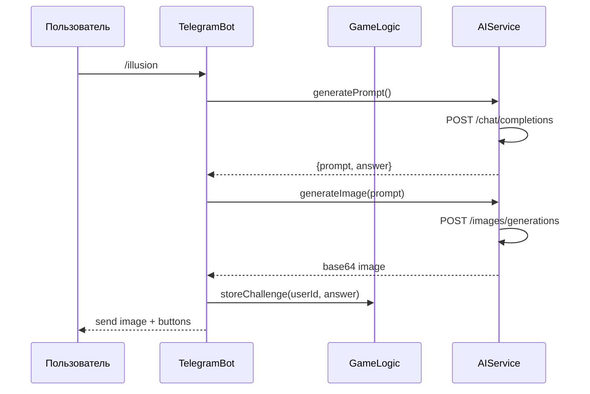
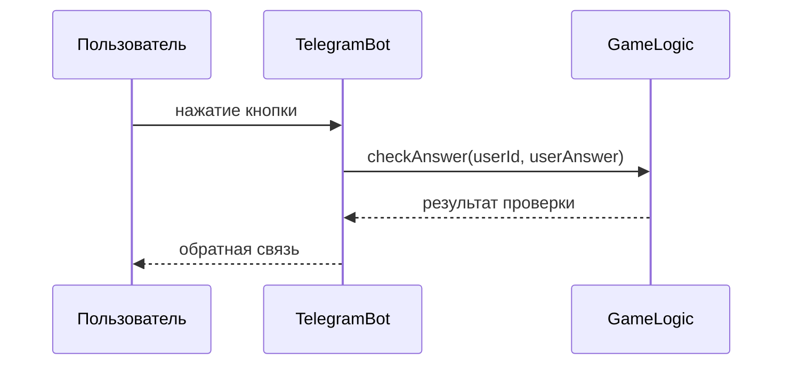

# Архитектура интеграции с AI сервисами

## Обзор
Этот документ описывает архитектуру интеграции Telegram бота с AI сервисами для генерации промптов и изображений оптических иллюзий.

## Компоненты системы

### 1. AIService
Класс, отвечающий за взаимодействие с AI API:
- Генерация промптов оптических иллюзий
- Генерация изображений на основе промптов
- Обработка ответов от AI сервисов

### 2. GameLogic
Класс, реализующий игровую логику:
- Управление состоянием игры для каждого пользователя
- Проверка правильности ответов
- Предоставление обратной связи

### 3. TelegramBot
Существующий класс, который будет расширен:
- Обработка новых команд
- Отправка изображений и кнопок
- Получение и обработка ответов пользователей

## Поток данных

### Генерация задания


### Обработка ответа


## Структура данных

### PromptResponse
```cpp
struct PromptResponse {
    std::string prompt;
    std::string correctAnswer; // "first", "second", "equal"
};
```

### Challenge
```cpp
struct Challenge {
    std::string userId;
    std::string prompt;
    std::string correctAnswer;
    std::string imageBase64;
    std::chrono::time_point<std::chrono::system_clock> createdAt;
};
```

## API клиенты

### HTTP клиент для AI сервисов
Используем существующую инфраструктуру из TelegramBot.cpp с boost::beast для:
- POST запросов к API
- Обработки JSON ответов
- Декодирования base64 изображений

## Управление состоянием

### Хранение активных заданий
- В памяти (std::map) для простоты
- Ключ: userId, Значение: Challenge
- Очистка по таймауту (например, 10 минут)

## Обработка ошибок

### Сетевые ошибки
- Повторные попытки (retry) с экспоненциальной задержкой
- Логирование ошибок
- Уведомление пользователя о проблемах

### Ошибки AI сервисов
- Проверка HTTP кодов ответов
- Обработка ошибок в JSON ответах
- Предоставление пользователю понятных сообщений

## Безопасность

### API ключи
- Хранение в переменных окружения
- Не включать в код или конфигурационные файлы
- Логирование без раскрытия ключей

### Валидация данных
- Проверка входящих сообщений от Telegram
- Ограничение размера получаемых данных
- Санитизация пользовательского ввода